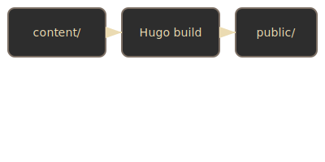

This article is a **page bundle** (leaf bundle). Notice it lives at
`software/hugo-setup/index.md` — not `hugo-setup.md`.

## What makes this a page bundle?

The directory structure looks like this:

```
content/software/hugo-setup/
├── index.md          ← this file (the page content)
├── architecture.svg  ← co-located resource (image)
└── notes.txt         ← co-located resource (data)
```

Everything in this folder **belongs to this page**. Hugo treats the sibling
files as *page resources* accessible via `.Resources` in templates.

## Why use bundles?

- **Co-location**: images and files live next to the article that uses them,
  not in a global `static/` folder.
- **Resource processing**: Hugo can resize, crop, and fingerprint bundled
  images at build time.
- **Portability**: move or delete the folder and everything travels together.

## Using a bundled image

In a template you'd access it with:

```go-html-template
{{ $img := .Resources.GetMatch "architecture.svg" }}
{{ with $img }}
  
{{ end }}
```

Or reference it directly in Markdown:


